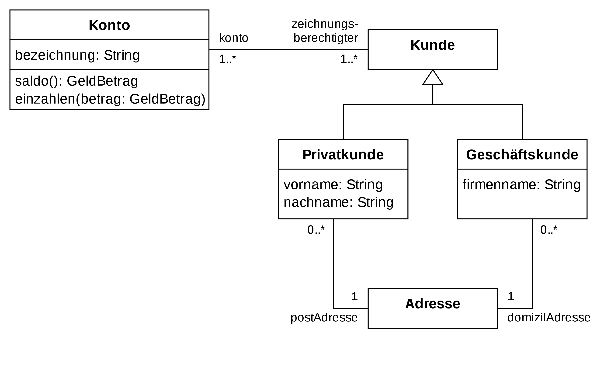

#Was ist eine Klasse im Kontext von UML2
Klassen umfassen den eigentlichen Kern der Modellierungssprache. Die Spracheinheit Klasse definiert die möglichen Relationen
zwischen Klassen. Die grundlegenden Prinzipien von UML 2 sind auch hier definiert

Diese Spracheinheit enthält vier Unterpakete. Das Unterpaket Kernel umfasst zentrale Modellierungselemente, 
die aus der UML 2.0 Infrastructure wiederverwendet werden. Dazu gehören die Klasse, die Ausprägungsspezifikation, 
der Namensraum, das Paket, das Attribut, die Assoziation, die Abhängigkeitsbeziehung, der Paketimport, 
die Paketverschmelzung und die Generalisierung. Das zweite Unterpaket, AssociationClasses, 
umfasst die Definition von Assoziationsklassen. Interfaces, das dritte Unterpaket, stellt die Definition von Schnittstellen bereit. 
Schließlich deklariert das Unterpaket PowerTypes Modellelemente für die sogenannten PowerTypes.  
Diese Spracheinheit enthält vier Unterpakete. Das Unterpaket Kernel umfasst zentrale Modellierungselemente, 
die aus der UML 2.0 Infrastructure wiederverwendet werden. Dazu gehören die Klasse, die Ausprägungsspezifikation, 
der Namensraum, das Paket, das Attribut, die Assoziation, die Abhängigkeitsbeziehung, der Paketimport, 
die Paketverschmelzung und die Generalisierung. Das zweite Unterpaket, AssociationClasses, umfasst die Definition von Assoziationsklassen. Interfaces, das dritte Unterpaket, stellt die Definition von Schnittstellen bereit. Schließlich deklariert das Unterpaket PowerTypes Modellelemente für die sogenannten PowerTypes.

Elemente aus dieser Spracheinheit werden meistens in Klassendiagrammen, Objektdiagrammen und Paketdiagrammen dargestellt.
   <b> Hier ein Beispiel eines Klassendiagramms:</b>

##Eine Definition die ich mir abstahiert habe ist: 
Klassen sind Baupläne mit denen wir Instanzen dieser Baupläen erstellen können. Diese Baupläne beinhalten sowohl alle
Daten(Attribute), als auch alle Funktionalitäten(Methoden). Darüber hinaus gibt es Daten und Funktionalitäten,
welche nicht an eine Instanz des Bauplans gebunden sind, sondern zu dem Bauplan selber gehören.

#Was ist eine Klasse <- spezifisch für Python
Schauen sie dafür [classes.py](classes.py), [vererbung.py](vererbung.py) in der Ordnerstruktur an.
