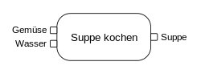

#Was genau ist UML(Unified Modeling Language)

##Basics:
Eine vereinheitlichte Art und Weise alles Mögliche zu modellieren. Hier einmal die Timeline der Modellierungssprachen seit 1990.

##Strukturierung:

###Teilspezifikation:
Es existieren 3 verschiedene Teilspezifikationen:

Die erste ist UML 2.0 Infrastructure Specification und legt das Fundament für UML 2, sie beschreibt die am 
häufigsten verwendenten Elemente von UML. Beispielweise Klasse, Assoziationen und Multiplizität eines Attributs.

UML 2.0 Superstructure Specification baut auf dem Fundament von UML 2.0 Infrastructure Specification auf und definiert
Modellelemente welche für spezifische Anwendungsbereiche benötigt werden. Typische Konzepte sind: Anwedungsfall, Aktivität
und der Zustandsautomat.

UML 2.0 Object Constraint Language bestimmt die Object Constraint Language 2.0 (OCL2.0)

Es gibt noch ein weiteres und zwar das UML 2.0 Diagram Interchange und ist eine Neuerung in UML 2.0. Hier wird ein
standardisiertes Format des Diagramm-Layouts spezifiziert, damit es in verschiedenen Werkzeugen genutzt werden kann

###Metamodellierung:
Genau wie bei natürlichen Sprachen, welche über Lexika und Grammatiken eine Selbstbeschreibung haben, gibt es diese auch
für UML.
Diese Sprachkonzepte sind in vier Schichten gegliedert, M0-M3.

Mithilfe der Meta Object Facility(MOF) werden Modellelemente von UML2 spezifiziert und dadurch z.B. mit dem Format 
Meta Interchange XMI austauschbar. Diese MOF befindet sich auf der Ebene M3 und stellt eine der vier Schichten dar. 
Man kann es als die "Metasprache der Metasprachen bezeichnen"(das Metametamodell) und beinhaltet grundlegende Elemente
(Pakete, Klassen, Assoziationen und Attribute). 

Die Metasprache UML2(M2) ist in MOF definiert und stellt die bekannten
Sprachmerkmale zur Verfügung. Darüber hinaus stellt sie auch noch die Konzepte für Anwendungsfälle, Zustandsautomaten und mehr dar.

M1 beinhaltet die in der Praxis hergestellten UML-Modelle, welche eine Abstraktion der Objekte in der M0-Schicht, also dem
realen Anwendungsfall, sind.

##Spracheinheiten:
###Aktion:   
Aktionen(actions) sind elementare Bausteine für die Modellierung von Verhalten. Sie können Eingabewerte über Eingabepins
entgegennehmen oder über Ausgabepins produzieren. In Folgendem Beispiel ist die Aktion Suppe kochen:  
####Pins: 
 Die Pins sind hier "Gemüse, Wasser" als Eingabepins und "Suppe" als Ausgabepin 
Sollten keine Pfeile auf den Pins zu sehen sein, stehen an der linken Seite Eingabepins und an der rechten Seite 
 Ausgabepins wie in folgendem Beispiel:

###Aktivitäten
Eine Aktivität ist ein Modell für ein Verhalten. Sie besteht aus Aktionen, welche über Kontroll- und Datenflüsse miteinander
verbunden werden.  
Hier ein Beispiel:

###Allgemeines Verhalten
Definiert Verhaltensbeschreibungen bestimmter Modellelemente eines in UML2 modellierten Systems
###Anwendungsfälle
Use-cases stellt Elemente für die Modellierung für Anforderungen an ein System dar. Hier gibt es einmal den Akteur, also den
Benutzer des System und den use-case, also den Nutzen/Anwendungsfall den ein System haben, bzw. erfüllen muss. 
Hier ein Beispiel: 
Der Sender ist hier der Akteur und SMS verschicken und Fotomessage verschicken sind hier die Use-Cases

###Klassen
Genaue Beschreibung in dieser [Datei](classes.py)

###Es gibt noch weitere Spracheinheiten, diese sind aber für das Klassendiagramm weniger von Interesse und können eigenständig recherchiert werden

###Für einen super definierten Guide wie wir Klassendiagramme aufsetzen(Wichtig für die Klausur) gehen sie auf folgenden Link:
#[Klassendiagramm erstellen](https://creately.com/blog/de/diagramme/uml-klassendiagramm/)

